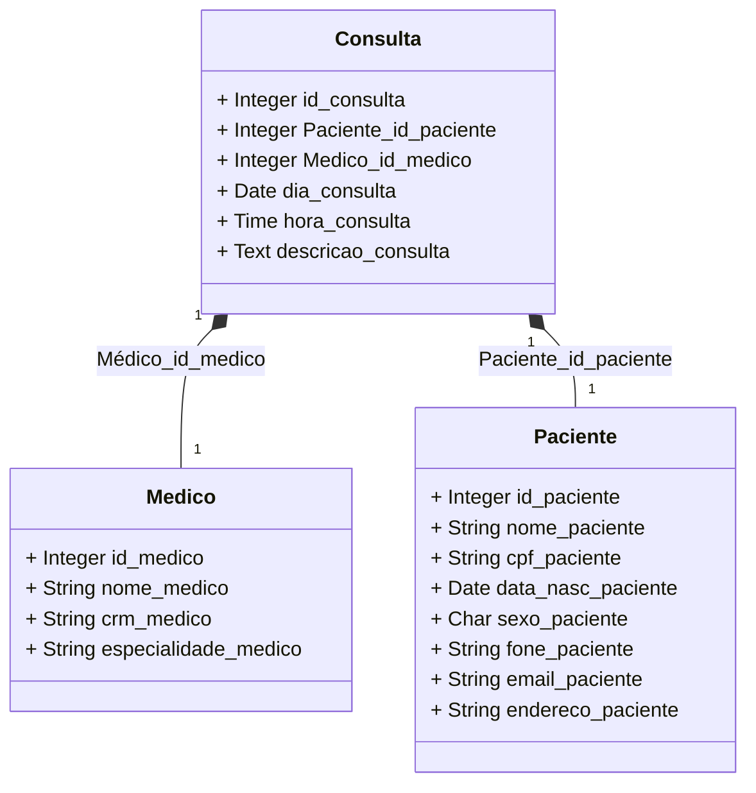

<b>Banco de Dados de uma Clínica:</b> 
Projeto para a disciplina Programação Web na faculdade.
Para funcionar é necessário ter o Bootstrap instalado na mesma pasta com os arquivos como visto na imagem a seguir:

<b>Diagrama de classes</b>

<b>Dependências:</b> 
<b>Bootstrap</b>- use o link abaixo ou pesquise no seu navegador-
https://getbootstrap.com . 
<b>SQL</b> feito pelo <b>DBDesigner</b>.

<b>Atenção:</b> 
Para usar o projeto, lembre-se de alterar o diretório no começo dos códigos e verifique o nome colocado nas tabelas.

<b>Aula-1:</b> 
O objetivo desse projeto é sobre cadastro de pacientes, médicos e consultas, usando banco de dados, a matéria que estou aprendendo na disciplina. Vou atualizar conforme o professor for expandindo o conteúdo 😀👍.

<b>Aula-2:</b> 
Adicionei os cadastros por meio de formulário e a integração com o banco de dados é feito pelo config.php e "salvar_x.php", está dando erro no cadastro do médico então vou tentar arrumar antes de fazer o do paciente. O da clínica é mais complexo então fica para depois.

<b>Update:</b> 
Consegui arrumar os erros e está aparentemente tudo funcionando na parte de paciente e médico. A da clínica não dá para fazer ainda pois usa as keys das outras 2 então é mais complexo.

<b>Aula-3:</b> 
Adicionai as partes "listar paciente" e "listar médico", com uma lista dos dados cadastrados. Adicionei nas seções "salvar paciente e salvar médico" um pop-up que diz que o cadastro foi bem sucedido ou não, e redireciona o usuário a "Listar". As abas de "consulta" ainda não foram implementadas.

<b>Aula-4:</b> 
Adicionei botões de Editar e Excluir nas listas de Médicos e Pacientes (listar), que redirecionam para as páginas de ação (editar e salvar). Fiz o código das abas de editar baseado nas de cadastrar e adicionei em "salvar" os case de editar e excluir. Ainda não vi chaves estrangeiras para poder fazer o código de Consultas, ainda vai demorar um pouco.
